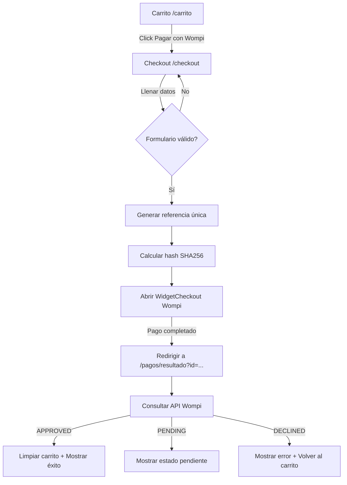

# Integración Wompi — Miracor

Integrar el Widget Checkout de Wompi al proyecto React/Vite de Miracor para procesar pagos online directamente desde el carrito de compras existente.

## Resumen técnico de Wompi

La integración usa el **Widget Checkout** (opción recomendada por Wompi) que permite al cliente pagar sin salir del sitio. El flujo es:

1. El frontend genera una **referencia única** (ej: `MIRACOR-{timestamp}-{random}`)
2. El **hash SHA256 de integridad** se calcula con: `referencia + monto_centavos + moneda + secreto_integridad`
3. Se abre el widget con `new WidgetCheckout({...}).open(callback)`
4. Wompi redirige a `/pagos/resultado?id=TRANSACTION_ID` al finalizar

> [!IMPORTANT]
> El **Secreto de Integridad** NUNCA debe exponerse en el frontend. Sin embargo, dado que este es un proyecto puramente frontend (Vite sin backend), la firma SHA256 se generará en el cliente usando `crypto.subtle`. Esta es una limitación temporal antes de agregar un backend. La `pub_key` pública sí puede ir en el cliente.

> [!WARNING]
> Para producción real, la firma de integridad debería calcularse en un backend (Node.js, PHP, etc.) para no exponer el secreto. Se documenta en el `.env.example` y el código dejará un TODO claro.

---

## Variables de entorno — `.env.example`

### [NEW] `.env.example` (raíz del proyecto)
Variables que el comercio debe configurar desde el dashboard de Wompi:
- `VITE_WOMPI_PUBLIC_KEY` — Llave pública (segura en frontend, empieza con `pub_test_` o `pub_prod_`)
- `VITE_WOMPI_INTEGRITY_SECRET` — ⚠️ Solo para desarrollo/testing. En producción mover a backend
- `VITE_WOMPI_REDIRECT_URL` — URL de retorno tras el pago

---

## Archivos a crear/modificar

### Utilidades Wompi

#### [NEW] `src/utils/wompi.js`
Helper con dos funciones puras:
- `generateReference(prefix)` → genera una referencia única alfanumérica
- `generateIntegrityHash(reference, amountCents, currency, secret)` → calcula SHA256 con `crypto.subtle`

#### [NEW] `src/hooks/useWompiCheckout.js`
Hook React que:
- Carga el script `https://checkout.wompi.co/widget.js` dinámicamente
- Expone `openWompiCheckout({ amountCents, customerData, redirectUrl })` 
- Maneja estado: `loading`, `error`, `transactionResult`

---

### Nueva página de Checkout

#### [NEW] `src/pages/Checkout.jsx`
Página `/checkout` con:
- Formulario de datos del cliente (nombre, email, teléfono, cédula)
- Resumen del pedido (productos, subtotal, IVA, envío, total)
- Botón "Pagar con Wompi" que abre el widget
- Validación de formulario antes de abrir el checkout

#### [NEW] `src/pages/PaymentResult.jsx`
Página `/pagos/resultado` que:
- Lee `?id=` de la URL
- Consulta el estado de la transacción en `https://production.wompi.co/v1/transactions/{id}` (o sandbox)
- Muestra: Aprobado ✅ / Pendiente ⏳ / Rechazado ❌
- Limpia el carrito si el pago fue aprobado

---

### Modificaciones existentes

#### [MODIFY] `src/App.jsx`
Agregar dos nuevas rutas:
- `/checkout` → `<Checkout />`
- `/pagos/resultado` → `<PaymentResult />`

#### [MODIFY] `src/pages/Cart.jsx`
Reemplazar el botón "Solicitar por WhatsApp" por:
- Un botón primario **"Pagar con Wompi"** → navega a `/checkout`
- Mantener el link de WhatsApp como opción secundaria

#### [MODIFY] `vite.config.js`
Exponer las vars de entorno `VITE_WOMPI_*` a través de Vite (ya funciona con el prefijo `VITE_`).

---

## Flujo completo

---

## Verification Plan

### Manual
1. Abrir `http://localhost:5173/carrito` con productos
2. Hacer clic en "Pagar con Wompi" → debe ir a `/checkout`
3. Llenar datos y hacer clic en el botón de pago → debe abrir el widget de Wompi
4. Usar tarjetas de prueba de sandbox: `4242 4242 4242 4242`, CVV: `123`, exp: `12/25`
5. Verificar que `/pagos/resultado` muestre el estado correcto
6. Confirmar que el carrito se limpia si el pago fue `APPROVED`
